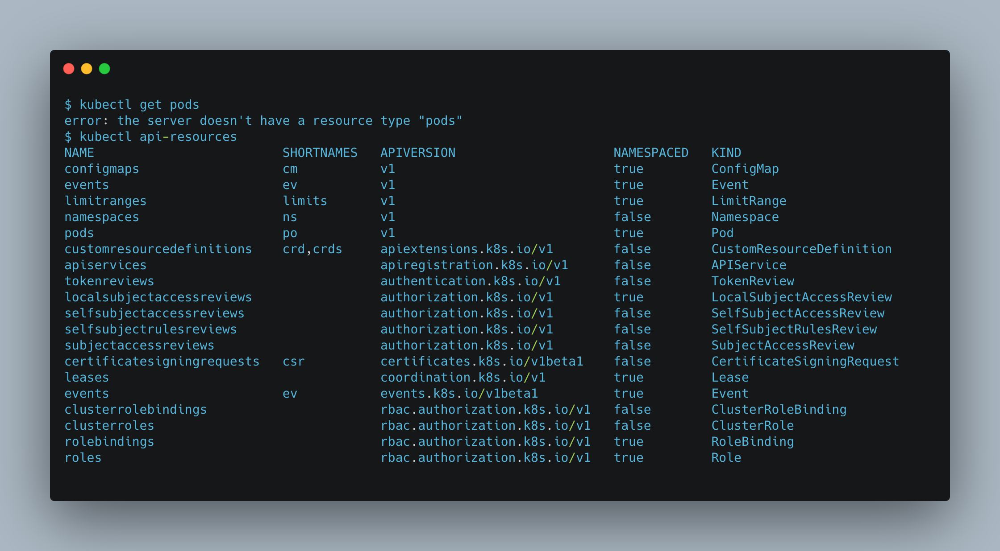

# `kcp` is a minimal Kubernetes API server

How minimal exactly? `kcp` doesn't know about [`Pod`](https://kubernetes.io/docs/concepts/workloads/pods/)s or [`Node`](https://kubernetes.io/docs/concepts/architecture/nodes/)s, let alone `Deployment`s, `Service`s, `LoadBalancer`s, etc.

By default, `kcp` only knows about:

- [`Namespaces`](https://kubernetes.io/docs/concepts/overview/working-with-objects/namespaces/)
- [`ServiceAccounts`](https://kubernetes.io/docs/reference/access-authn-authz/service-accounts-admin/) and [role-based access control](https://kubernetes.io/docs/reference/access-authn-authz/rbac/) types like `Role` and `RoleBinding`
- [`Secrets`](https://kubernetes.io/docs/concepts/configuration/secret/) and [`ConfigMaps`](https://kubernetes.io/docs/concepts/configuration/configmap/), to store configuration data
- [`CustomResourceDefinitions`](https://kubernetes.io/docs/concepts/extend-kubernetes/api-extension/custom-resources/), to define new types
- a handful of other low-level resources like [`Lease`](https://kubernetes.io/docs/reference/kubernetes-api/cluster-resources/lease-v1/)s, [`Event`](https://kubernetes.io/docs/tasks/debug-application-cluster/debug-application-introspection/)s, etc.

Like vanilla Kubernetes, `kcp` persists these resources in etcd for durable storage.

Any other resources, including Kubernetes-standard resources like `Pod`s, `Node`s and the rest, can be added as [CRDs](https://kubernetes.io/docs/concepts/extend-kubernetes/api-extension/custom-resources/) and reconciled using the standard controllers.

## Why would I want that?

Kubernetes is mainly known as a container orchestration platform today, but we believe it can be even more.

With the power of `CustomResourceDefinition`s, Kubernetes provides a flexible platform for declarative APIs of _all types_, and the reconciliation pattern common to Kubernetes controllers is a powerful tool in building robust, expressive systems.

At the same time, a diverse and creative community of tools and services has sprung up around Kubernetes APIs.

Imagine a declarative Kubernetes-style API for _anything_, supported by an ecosystem of Kubernetes-aware tooling, separate from Kubernetes-the-container-orchestrator.

That's **`kcp`**.

## Is `kcp` a "fork" of Kubernetes? 🍴

_No._

`kcp` as a prototype currently depends on some unmerged changes to Kubernetes, but we intend to pursue these changes through the usual KEP process, until (hopefully!) Kubernetes can be configured to run as `kcp` runs today.

Our intention is that our experiments _improve Kubernetes for everyone_, by improving CRDs and scaling resource watching, and enabling more, better controllers _for everyone_, whether you're using Kubernetes as a container orchestrator or not.

Our `kcp` specific patches are in the [feature-logical-clusters](https://github.com/kcp-dev/kubernetes/tree/feature-logical-clusters) feature branch in the [kcp-dev/kubernetes](https://github.com/kcp-dev/kubernetes) repo. See [DEVELOPMENT.md](DEVELOPMENT.md) for how the patches are structured and how they must be formatted during our experimentation phase.  See [GOALS.md](GOALS.md) for more info on how we intend to use `kcp` as a test-bed for exploring ideas that improve the entire ecosystem.

## What's in this repo?

First off, this is a prototype, not a project. We're exploring these ideas here to try them out, experiment, and bounce them off each other.  Our [basic demo](contrib/demo/README.md) leverages the following components to show off these ideas:

- **`kcp`**, which serves a Kubernetes-style API with a minimum of built-in types.
- **`cluster-controller`**, which along with the `Cluster` CRD allows `kcp` to connect to other full-featured Kubernetes clusters, and includes these components:
  - **`syncer`**, which runs on Kubernetes clusters registered with the `cluster-controller`, and watches `kcp` for resources assigned to the cluster
  - **`deployment-splitter`**, which demonstrates a controller that can split a `Deployment` object into multiple "virtual Deployment" objects across multiple clusters.
  - **`crd-puller`** which demonstrates mirroring CRDs from a cluster back to `kcp`

## So what's this for?

#### Multi-Cluster Kubernetes?

`kcp` could be _useful_ for [multi-cluster scenarios](docs/investigations/transparent-multi-cluster.md), by running `kcp` as a control plane outside of any of your workload clusters.

#### Multi-Tenant Kubernetes?

`kcp` could be _useful_ for multi-tenancy scenarios, by allowing [multiple tenant clusters inside a cluster](docs/investigations/logical-clusters.md) to be managed by a single `kcp` control plane.

#### Local Kubernetes Development?

`kcp` could be _useful_ for local development scenarios, where you don't necessarily care about all of Kubernetes' many built-in resources and their reconiling controllers.

#### Embedded/low-resource scenarios?

`kcp` could be _useful_ for environments where resources are scarce, by limiting the number of controllers that need to run. Kubernetes' asynchronous reconciliation pattern can also be very powerful in disconnected or intermittently connected environments, regardless of how workloads actually run.

### Is that all?

No! See our [GOALS.md](GOALS.md) doc for more on what we are trying to accomplish with this prototype and our [docs/ directory](docs/).

## What does `kcp` stand for?

`kcp` as a project stands for equality and justice for all people.

However, `kcp` is not an acronym.

## This sounds cool and I want to help!

Thanks! And great!

This work is still in early development, which means it's _not ready for production_, but also that your feedback can have a big impact.

You can reach us here, in this repository via issues and discussion, or:

- Join the mailing lists
    - [kcp-dev](https://groups.google.com/g/kcp-dev) for development discussions
    - [kcp-users](https://groups.google.com/g/kcp-users) for discussions among users and potential users
- Subscribe to the [community calendar](https://calendar.google.com/calendar/embed?src=ujjomvk4fa9fgdaem32afgl7g0%40group.calendar.google.com) for community meetings and events
    - The kcp-dev mailing list is subscribed to this calendar
- Browse the [shared Google Drive](https://drive.google.com/drive/folders/1FN7AZ_Q1CQor6eK0gpuKwdGFNwYI517M?usp=sharing) to share design docs, demo videos, meeting recordings
